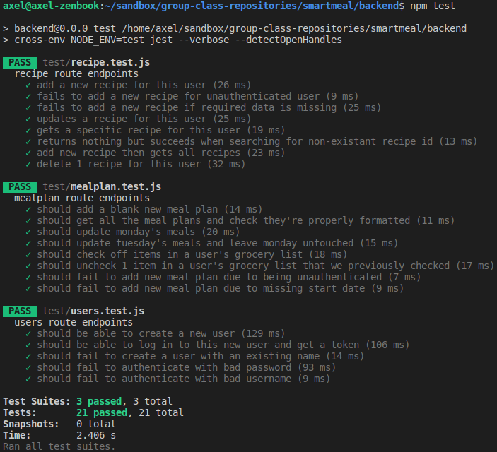

# SmartMeal
Meal planning web app that shows you the nutritional and budgetary impact of your planned meals. Users can create weekly meal plans, save custom recipes, and get auto-generated shopping lists to use at the grocery store.

## Directory organization:
* This project contains two node.js projects, separating the frontend and the backend
* `frontend`: React webapp
* `backend`: Node.js server running Express and MongoDB
  * `backend/test`: testing scripts for the backend

## First-time setup:
1. Install the latest [MongoDB](https://docs.mongodb.com/manual/installation/) (installation differs on Linux, Windows, macOS; select the correct one)
2. Install the latest node.js (recommended to use [nvm](https://github.com/nvm-sh/nvm) on Linux and macOS, [nvm-windows](https://github.com/coreybutler/nvm-windows) on Windows, )
3. Run `npm install` the root directory to install dependencies in both `frontend` and `backend`
4. Install `nodemon` globally if you don't yet have it, as we use it for hot-reloading the backend
```
$ npm install nodemon -g
```
4. The first time you run the webapp, you'll need to create a new user, since the database will be empty. This was previously done with a shell script, but can now be done using the existing UI. If you're feeling adventurous, you can load the script we used using the following commands  on Windows after starting the `mongod` service (see step 1 in the next section).

```
(Linux/macOS) 
$ mongo < backend/db/load_db.sh
(Windows)   
$ cd "C:\Program Files\MongoDB\Server\4.4\bin"
$ Get-Content C:\Users\Axel\Documents\smartmeal\backend\db\load_db.sh | .\mongo
```
## Running
1. Start the MongoDB server: 
   * Linux: `mongod`
   * macOS: `brew services start mongodb-community@4.4` (assuming you used `homebrew`)
   * Windows: `cd "C:\Program Files\MongoDB\Server\4.4\bin"`, then `.\mongod`
2. Start the webapp:
   * Method 1: run `npm start` in `frontend/`, and `npm run watch` (hot-reload) or `npm start` (no hot-reload) in `backend/`
   * Method 3 (preferred): run `npm start` in the root directory. This starts the front- and backend simultaneously in a single terminal using a custom `npm` script

## Running tests
* Backend: uses `Jest` to test API endpoints with `supertest`
  * 3 test suites, one for each set of endpoints (users API, mealplans API, recipes API)
```
$ cd backend
$ npm test
```

* Frontend

## Documentation
* Backend documentation is generated with Postman and can be viewed at 
* Frontend

## Extra useful information:
* Frontend runs on port 4000 (app viewable at `localhost:4000`)
* Backend runs on port 3000


